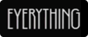

- This is a [NEXT](https://nextjs.org) app bootstrapped w [`create-next-app`](https://nextjs.org/docs/app/api-reference/cli/create-next-app)
- A monorepo using trunk-based development
- Launch [locally](http://localhost:3000): `npm run dev`, `yarn dev`, `bun dev`, ...
- `app/page.tsx` is our home page (start looking here)
- `app/layout.tsx` is our root DOM node (apply global wrappers here)
- That's it, play around and go find docos for packages in `package.json` to learn more...
- Before each commit: prettier, lint, ...
- Infra: Vercel, GitHub, more coming...
